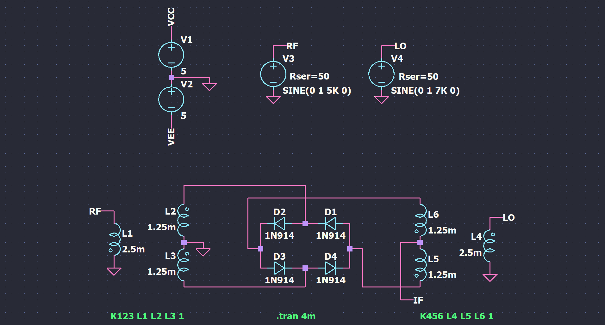
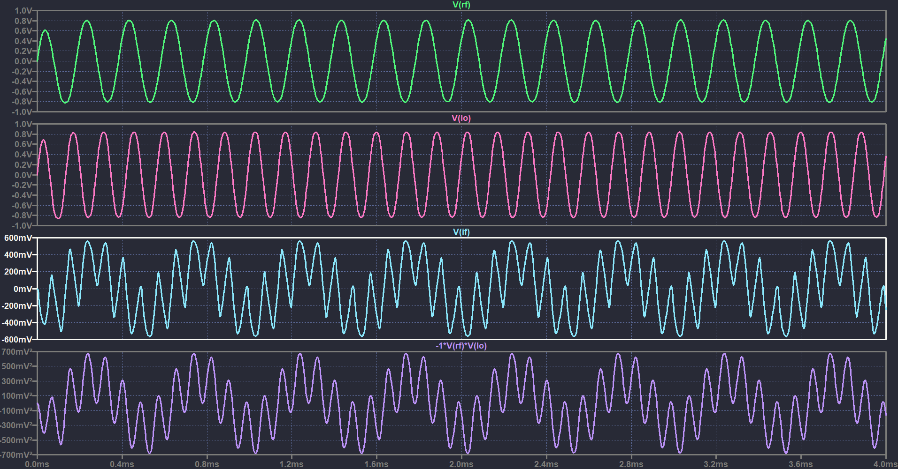

# Ideal Passive Mixer
This repository contains an example circuit to demonstrate an ideal passive mixer.

The given example circuit helps give insight into how a passive RF diode mixer works!

## Circuit schematic

## Circuit simulation

